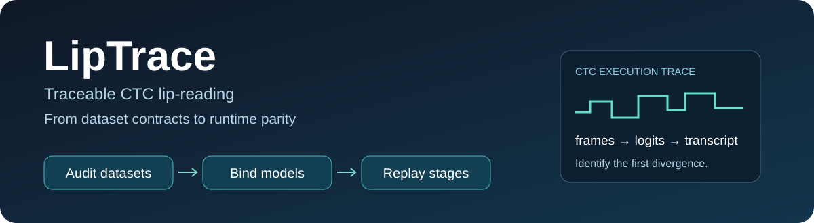
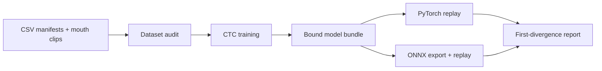

<p align="center"></p>

# LipTrace

**Traceable CTC lip-reading — from dataset contracts to runtime parity.**

[](https://github.com/ntthienphuc/liptrace/actions/workflows/ci.yml)
[](LICENSE)
[](https://github.com/ntthienphuc/liptrace/releases)

LipTrace turns a LipNet-style character-CTC recognizer into a reusable, auditable
Python workflow. Train on your own pre-cropped mouth clips, bind the resulting
weights to their ordered charset and preprocessing, and locate the first stage
that changes when you export the recognizer to ONNX.

**A checkpoint can load successfully and still decode incorrectly.** Swapping two
charset entries preserves every tensor shape while changing the meaning of the
CTC output. LipTrace checks artifact identity and semantic configuration before
returning a transcript; its replay also checks discrete decisions even when
floating-point logits are within tolerance.

## What you can do

| Task | LipTrace output |
| --- | --- |
| Audit train/validation/test CSVs | Every detected media, group, timestamp, label and CTC issue with row and reason |
| Train a LipNet-style recognizer | Training-only charset, validation-selected checkpoint, final test predictions and sanitized bundle |
| Register an existing compatible checkpoint | SHA-256-bound weights, ordered charset, blank index, geometry, preprocessing and decoder |
| Predict a pre-cropped mouth clip | Transcript plus decoded frames, sampled indices, tensor, logits and CTC path |
| Export and replay in ONNX Runtime | Separate export bundle and a stage-level parity report |
| Recompute saved predictions | Explicit sample-mean CER, WER and exact match |



## Install and run a complete example

The initial validation covers Python 3.9–3.12 (specific OS/version combinations
are listed in [validation](docs/VALIDATION.md)). Use a fresh environment and install
CPU PyTorch first (or choose a compatible CUDA build yourself).

```bash
git clone https://github.com/ntthienphuc/liptrace.git
cd liptrace
python -m venv .venv
# Linux/macOS: source .venv/bin/activate
# PowerShell: .\.venv\Scripts\Activate.ps1
python -m pip install torch==2.8.0 --index-url https://download.pytorch.org/whl/cpu
python -m pip install ".[onnx]"
liptrace demo --out demo_run --onnx
```

The demo creates **12 synthetic clips**, trains a tiny model for one epoch, runs
two PyTorch traces, exports ONNX, and compares PyTorch against ONNX Runtime on CPU.
Inspect `demo_run/receipt.json` and `demo_run/onnx_comparison.json`.
These fixtures verify software execution; their predictions are not a Vietnamese
recognition benchmark. No pretrained model or human video is downloaded.

Omit `--onnx` and the optional installation extra for the PyTorch-only demo.
Output directories must be new, so an experiment cannot silently overwrite an
earlier one. [Reproduction and release verification](REPRODUCE.md).

## Use your own data and model

Each UTF-8 CSV needs `clip_path,text,group_key`. Relative clip paths resolve
against the CSV's directory. `speaker_dir` or `stem` can serve as a legacy group
column. Supply source recording groups; these fields do not establish verified
speaker identity. Optional `start_s,end_s,source_duration_s` are checked when
supplied. These timestamps describe the source segment; inference consumes the
already cropped clip, not a full recording.

```csv
clip_path,text,group_key
mouth/session01_001.mp4,xin chao,source_recording_01
```

```bash
liptrace audit --train train.csv --val val.csv --test test.csv --max-frames 32 --out audit.json
liptrace train --train_csv train.csv --val_csv val.csv --test_csv test.csv --out_dir run --epochs 30
liptrace inspect --bundle run/bundle
liptrace predict --bundle run/bundle --video mouth.mp4 --out trace_torch
liptrace export --bundle run/bundle --out exported_bundle
liptrace trace --bundle exported_bundle --video mouth.mp4 --runtime onnx --out trace_onnx
liptrace compare --left trace_torch --right trace_onnx --out parity.json
```

An audit or comparison failure returns exit code **2** while preserving the
complete JSON report. Pass `--reference "xin chao"` to both replay commands to
compare CER/WER as an additional stage. The default normalization is
`legacy-lower-v1` (lowercase and whitespace); `--normalization nfc-lower-v1`
enables canonical Unicode normalization for a newly trained compatible charset.
Neither mode restores accents lost by historical ASCII labels.

To register an existing checkpoint:

```bash
liptrace bundle --checkpoint model.pt --out my_bundle
liptrace inspect --bundle my_bundle --expect-manifest-sha256 <trusted-digest>
```

The checkpoint must contain `model_state`, `charset`, `blank_index`, and `args`
with `img_size,max_frames,rnn_units,dropout`, and match the supplied architecture.
Registration inherits an existing `args.normalization` declaration and rejects
a conflicting override; checkpoints without that metadata use the legacy mode
unless explicitly declared otherwise. Newly created bundles preserve that choice
inside the sanitized checkpoint as well as the manifest.
The library currently supports **one architecture adapter**, not arbitrary
recognizers. [Contract and API details](docs/CONTRACTS.md).

## Research contribution and lineage

The software contribution is the integration of **CTC-aware dataset auditing,
semantic model bundles, and stage-level replay with discrete decoding checks**
around a working train/inference/export pipeline. The inherited model is a 3D
CNN followed by two bidirectional GRUs and a CTC classifier. LipTrace does not
introduce a new LipNet architecture, loss, or numerical-comparison algorithm.

The research implementation originated in the maintainer's Vietnamese LipNet
project associated with *Toward Edge-Deployable Vietnamese Lip Reading: A Compact
LipNet-Style PyTorch Recognizer with a Jetson-Oriented Inference Pipeline*
([DOI](https://doi.org/10.1109/CICN70047.2026.11594266)). This release extends that
implementation and changes data validation and frame decoding; it is a separate
software artifact rather than a reproduction of all reported paper results.

LipNet implementations and Auto-AVSR already provide training/inference
workflows, and Polygraphy already provides cross-runtime numerical comparison.
See the [primary-source comparison and claim boundaries](docs/RELATED_WORK.md)
before making novelty claims. There is no claim of being the first such toolkit.

## Validation and limits

The automated suite exercises healthy inputs and deliberate faults: reordered
charsets, modified weights, copied media across splits, infeasible repeated CTC
labels, invalid timestamps, failed decoding, and divergent replay stages. ONNX
parity uses a generated model and synthetic video; results and the exact commands
are in [VALIDATION.md](docs/VALIDATION.md).

- Input is an **already mouth-cropped video**. Face detection, mouth tracking,
  webcam capture and a consumer application are outside this release.
- Exact encoded-byte duplicates are detected; re-encoded near-duplicates are
  not. Source-group separation is distinct from verified speaker separation.
- Replay records decoded frames and transcripts: treat traces as data with their
  own permissions. Hashes detect changes relative to a trusted identity; they
  are not signatures, and a locally replaced manifest is not an external trust anchor.
- The model is bidirectional and clip-based. No streaming/causal, real-time
  Jetson Nano, TensorRT, new recognition accuracy or independent-reuse result is claimed.
- OpenCV may return a decodable prefix of a damaged container. Audit detects
  failed/empty decoding and resource-limit violations, not every codec defect.

## License, citation and contributions

The maintainer's source is **MIT licensed**. Dependencies retain their licenses;
third-party datasets, pretrained weights and human videos are not included and
are not covered by this license. [Third-party notices](THIRD_PARTY_NOTICES.md).

Use [CITATION.cff](CITATION.cff) to cite the software version. No SoftwareX
acceptance or software DOI is claimed. Bug reports and tested architecture
adapters are welcome; read [CONTRIBUTING.md](CONTRIBUTING.md).
[Software metadata for manuscript preparation](docs/SOFTWARE_METADATA.md) records
the release scope, dependencies, documentation and support location.
Software support and reproducible bug reports:
[GitHub Issues](https://github.com/ntthienphuc/liptrace/issues).
`Licence.txt` is an identical copy of `LICENSE` supplied for the SoftwareX
repository convention; distribution checks enforce that they remain synchronized.
